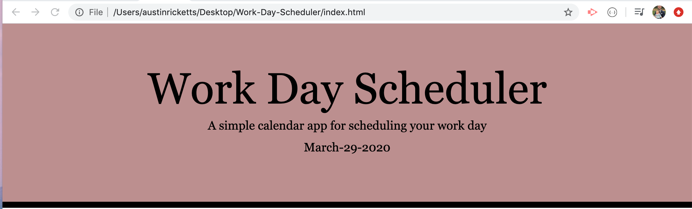
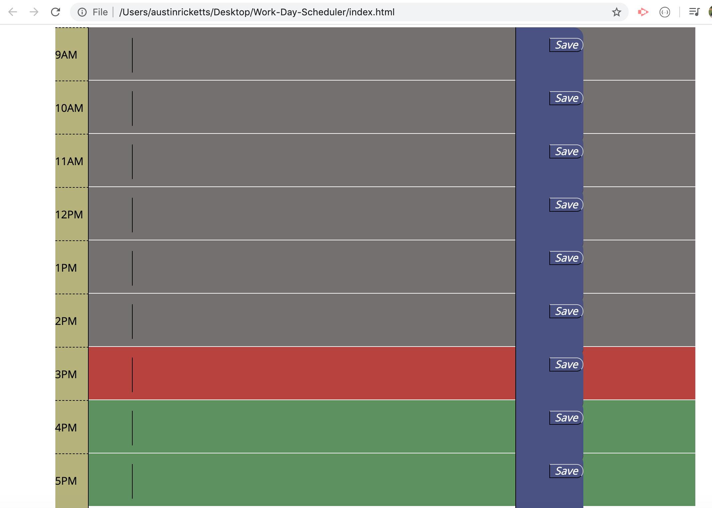
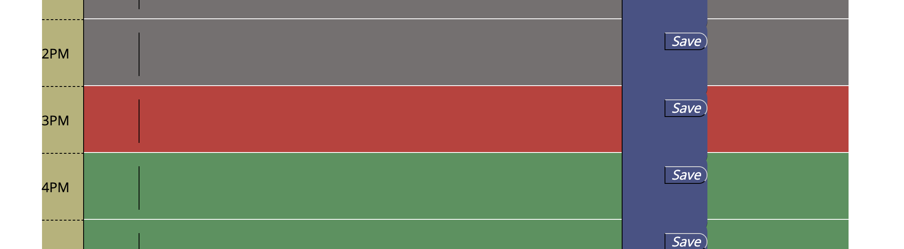
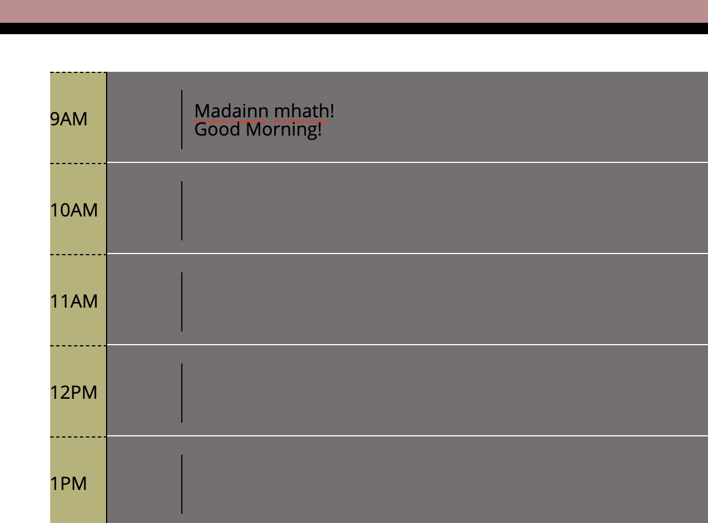
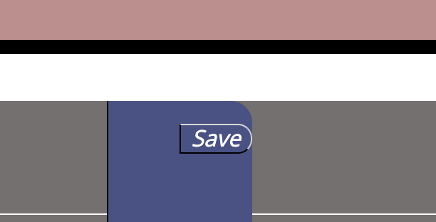

### Work-Day-Scheduler

## Deployed Link

[Work-Day-Scheduler](https://austin-ricketts.github.io/Work-Day-Scheduler/)

## Description

This website is meant to function as a daily workday calendar, so it runs from 9am to 5pm. After that: You're on your own!

The first Screen-Shot-1 above shows the top of the website. Here you will find the date of the calendar day which you log on.

The second Screen-Shot-2 gives an overall layout of the hours with their save button.

The third Screen-Shot-3 gives a closer look at the hours with varying color codes. The grey represents time past, the red is time present, and the green is the ghost of time future.

The fourth Screen-Shot-4 shows the functionality of the color time block. You may enter data. Here shown is good morning, written both in English and Scottish Gaelic.

The fifth Screen-Shot-5 shows a picture of the save button. When this is pressed, the data that was entered by the user is placed in local storage and will return even if the user closes the browser.

This website employs the moment.js api from MIT. This is where the precise time-tracking functionality comes from.

Jquery is also used instead of straight Javascript. It is a nice shorthand and gets the job done more quickly.